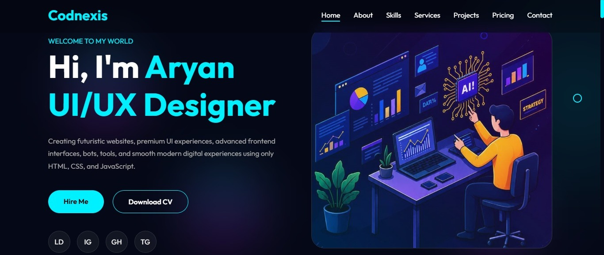

# 💼 AryanDevX — Personal Portfolio

<div align="center">

### 🚀 Modern • Responsive • Fast • Developer-Focused

A modern and responsive personal portfolio website built to showcase my
**projects, skills, experience, UI designs, and web development journey.**

[🌐 Live Demo](https://aryanntech.vercel.app/) •
[💻 GitHub](https://github.com/CodNexis) •
[📩 Contact Me](mailto:CodNexiss@gmail.com)

</div>

---

## 👋 About The Project

**AryanDevX Portfolio** is a modern personal portfolio website designed for
showcasing my work as a **Web Developer & UI Designer**.

The website focuses on:

- 🎨 Clean and modern UI
- 📱 Fully responsive design
- ⚡ Fast performance
- ✨ Smooth animations
- 🧩 Interactive components
- 📂 Project showcase
- 🛠️ Developer skills
- 📬 Contact options
- 📲 PWA / installable web-app support

The project is built with simple and lightweight technologies without
depending on a heavy frontend framework.

---

## ✨ Features

### 🎨 Modern UI

- Clean and professional interface
- Modern typography
- Responsive layouts
- Smooth transitions
- Interactive hover effects
- Developer-focused visual design

### 📱 Fully Responsive

Works across:

- 📱 Mobile phones
- 📲 Tablets
- 💻 Laptops
- 🖥️ Desktop screens

### ⚡ Performance

- Lightweight architecture
- No unnecessary dependencies
- Optimized assets
- Fast page loading
- Minimal JavaScript
- Browser caching support

### 🧑‍💻 Developer Portfolio

Includes sections for:

- 👋 About Me
- 🛠️ Skills
- 💼 Projects
- 🎨 UI Designs
- 📚 Experience
- 🚀 Services
- 📬 Contact
- 🔗 Social Links

### 📲 PWA Support

The portfolio can be configured as a **Progressive Web App** with:

- `manifest.json`
- `service-worker.js`
- App icons
- Offline caching
- Installable app experience
- Standalone display mode

---

## 🛠️ Tech Stack

| Technology | Purpose |
|------------|---------|
| 🌐 HTML5 | Website structure |
| 🎨 CSS3 | Styling & responsive design |
| ⚡ JavaScript | Interactivity & functionality |
| 📱 PWA | Installable web-app experience |
| 🔧 Service Worker | Caching & offline support |
| 📦 Web Manifest | App metadata & icons |
| 🚀 Vercel | Deployment |

---

## 🧰 Development Tools

The project can be developed using:

- Visual Studio Code
- Git
- GitHub
- Chrome DevTools
- Vercel
- Figma

---

## 📂 Project Structure

```text
aryan-portfolio (Aryan-DevX/
│
├── index.html
├── style.css
├── script.js
│
├── manifest.json
├── service-worker.js
│
├── dev.jpg
│
├──  icon.png
│
├── assets/
│   ├── images/
│   └── projects/
│
└── README.md
```

---

## 🚀 Getting Started

### 1️⃣ Clone the repository

```bash
git clone https://github.com/CodNexis/aryan-portfolio.git
```

### 2️⃣ Open the project

```bash
cd aryan-portfolio
```

### 3️⃣ Run the website

You can open:

```text
index.html
```

directly in your browser.

For better development and PWA testing, use a local server such as
**VS Code Live Server**.

---

## 🌐 Live Demo

### 🚀 Portfolio Website

**[Visit AryanDevX Portfolio](https://aryanntech.vercel.app/)**

---

## 📸 Preview




## 🧑‍💻 About Me

Hi, I'm **Aryan** 👋

I'm a **Web Developer & UI Designer from India** who enjoys creating
modern, responsive, and interactive websites.

I work with technologies such as:

- HTML
- CSS
- JavaScript
- React
- Responsive Web Design
- UI/UX Design

I focus on creating interfaces that are:

> **Simple • Fast • Responsive • User-Friendly**

I'm continuously learning new technologies and building real-world projects
to improve my development skills.

---

## 🎯 My Goals

My goal is to become a stronger full-stack developer while continuing to
improve my UI/UX and frontend development skills.

I'm interested in:

- 🚀 Web Development
- 🎨 UI/UX Design
- ⚡ Performance Optimization
- 📱 Progressive Web Apps
- 🤖 Modern Web Technologies
- 🧠 Problem Solving
- 🌍 Open Source

---

## 📊 Portfolio Highlights

Some things this portfolio focuses on:

```text
⚡ Fast Performance
📱 Responsive Design
🎨 Modern UI
🧩 Interactive Components
🚀 PWA Ready
🔧 Clean Code
📂 Project Showcase
🌐 SEO Friendly
```

---

## 🔍 SEO Features

The website includes several SEO-related features:

- Semantic HTML
- Meta title
- Meta description
- Keywords
- Author metadata
- Robots directives
- Canonical URL
- Open Graph metadata
- Twitter/X metadata
- Structured data
- Responsive viewport
- Theme color

---

## 📲 PWA Features

The portfolio supports Progressive Web App functionality.

### Included

```text
manifest.json
service-worker.js
app icons
offline caching
installable experience
standalone display
```

The Service Worker caches important assets and can provide cached content
when the device is offline.

---

## 🔐 Privacy

This portfolio does not intentionally collect sensitive personal information.

Any external services, analytics, contact forms, or third-party resources
should be reviewed before production deployment.

---

## 📬 Contact

Want to connect or collaborate?

### 📧 Email

```text
CodNexiss@gmail.co
```

### 💼 LinkedIn

https://linkedin.com/in/aryan-kasaudhan

### 💻 GitHub

https://github.com/CodNexis

### 🌐 Portfolio

https://aryanntech.vercel.app/

---

## 🤝 Contributing

This is primarily a personal portfolio project, but suggestions and
improvements are welcome.

If you'd like to contribute:

### 1. Fork the repository

```bash
git fork
```

### 2. Create a new branch

```bash
git checkout -b feature/improvement
```

### 3. Make your changes

Update the project and test everything locally.

### 4. Commit your changes

```bash
git commit -m "Add new improvement"
```

### 5. Push the branch

```bash
git push origin feature/improvement
```

### 6. Open a Pull Request

Explain what you changed and why.

---

## 🗺️ Roadmap

Future improvements may include:

- [x] Responsive design
- [x] Modern UI
- [x] Project showcase
- [x] Contact section
- [x] SEO metadata
- [x] PWA manifest
- [x] Service Worker
- [ ] Dark/Light theme
- [ ] Advanced project filtering
- [ ] Blog section
- [ ] More animations
- [ ] Performance optimization
- [ ] Accessibility improvements
- [ ] More interactive components

---

## 🧪 Browser Support

The website is designed for modern browsers.

| Browser | Support |
|---------|---------|
| Chrome | ✅ |
| Edge | ✅ |
| Firefox | ✅ |
| Safari | ✅ |
| Opera | ✅ |
| Mobile Browsers | ✅ |

---

## 📈 Performance Goals

The project aims to maintain:

- ⚡ Fast loading
- 📦 Small bundle size
- 🖼️ Optimized images
- 📱 Mobile-friendly layouts
- ♿ Better accessibility
- 🔎 SEO-friendly structure

---

## ⭐ Show Your Support

If you like this project, consider giving it a ⭐ on GitHub.

It helps support the project and motivates me to keep improving it! 🚀

---

## 📄 License

This project is available under the **MIT License**.

You are free to:

- Use the code
- Modify the code
- Learn from the project
- Build your own version

Please keep the original attribution where appropriate.

---

## 💡 Inspiration

This portfolio was created to represent my development journey and to
experiment with modern web design, responsive layouts, animations,
performance optimization, and Progressive Web App technologies.

---

<div align="center">

### 🚀 Keep Building. Keep Learning. Keep Creating.

**Made with ❤️ and lots of ☕ by Aryan**

⭐ If you found this project useful, don't forget to star the repository!

</div>
